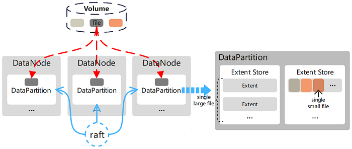
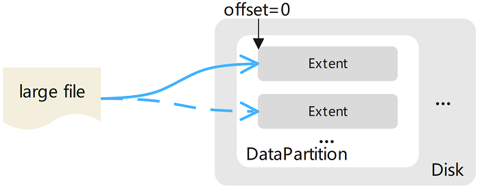
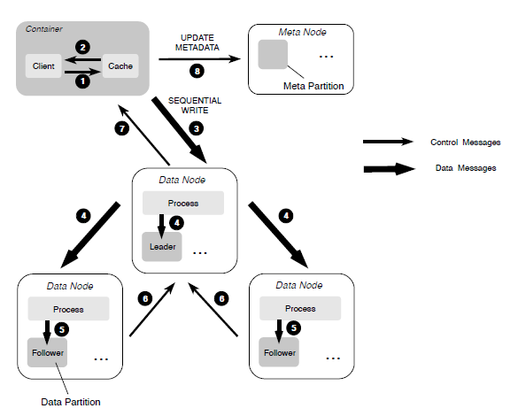

# 副本子系统


副本子系统的设计是为了满足大、小文件支持顺序随机访问的多租户需求，由多个数据节点（DataNode）组成，每个节点管理一组数据分片（DataPartition），多个节点的 DataPartition 构成了副本组。副本之间的数据为镜像关系，通过强一致的复制协议来保证副本之间的数据一致性，用户可以根据应用场景灵活的配置不同副本数。而 DataNode 作为本系统的存储引擎，用于管理单节点上的数据，既可用作持久化存储，也可用做纠删码存储的缓存节点。 另外，针对副本间的数据复制，系统采用两种不同的复制协议，在确保副本之间数据强一致性的同时还兼顾了服务的性能和 IO 的吞吐量。

## 存储拓扑



在 CubeFS 中，用户能够直接操作的是卷（Volume），这是一个逻辑概念，其数据存储在 DataNode 管理的磁盘上，在磁盘上会被组织在一个个 DataPartition 中，这也是一个逻辑概念。有了这层逻辑概念，DataNode 可在 DataPartition 的基础上进行副本的划分和管理，它们之间使用 Raft 协议保证副本的一致性。

## 系统特性

### 大文件存储

将大文件的内容存储为一个或多个扩展数据块（Extent）的文件，这些 Extent 可以分布在不同 DataNode 上的不同 DataPartition 中。将新文件写入 Extent 存储区时数据始终是以新 Extent 的零偏移量写入，这样就不需要在 Extent 内进行偏移。文件的最后一个范围不需要通过填充来补齐其大小限制（即该范围没有空洞），并且不会存储来自其他文件的数据。



### 小文件存储

将多个小文件的内存聚合存储在一个 Extent 内，并将每个文件内容的物理偏移量记录在相应的元数据（保存在元数据子系统中）中。删除文件内容（释放此文件占用的磁盘空间）是通过底层文件系统提供的文件穿洞接口（`fallocate()`）实现的，这种设计的优点是不需要实现垃圾回收机制，因此在一定程度上避免使用从逻辑偏移到物理偏移的映射。注意，这与删除大文件不同，在删除大文件时是直接从磁盘中删除对应的 Extent 文件的。


### 数据复制

副本成员间的数据复制，根据文件写入模式不同，CubeFS 采用不同的复制策略来提高复制效率。

- 当文件按顺序写入时，使用主备份复制协议来确保数据的强一致性并提供高效的 IO 能力。



- 在随机写入覆盖现有的文件内容时，采用一种基于 Multi-Raft 的复制协议以确保数据的强一致性。


### 故障恢复

由于存在两种不同的复制协议，当发现复制副本故障时，首先通过检查每个数据块的长度并使所有数据块对齐，启动基于主备份的复制协议的数据恢复。一旦这个过程完成，再使用基于 Multi-Raft 的数据恢复。

### 缓存数据

通过使用缓存类型的分区，实现缓存热数据，为纠删码卷提供缓存加速能力，在达到阈值的时候，动态的淘汰缓存中的冷数据。

## 分片结构

### 数据分片类型

数据存储在 DataNode 管理的磁盘上时会被组织在一个个 DataPartition 中，每个 DataPartition 在磁盘挂载目录下都有自己的目录，如下：

```text
[amy@node2 data]$ tree -a -L 1
.
|-- .diskStatus
|-- datapartition_1081_128849018880
|-- datapartition_2181_128849018880
|-- expired_datapartition_3620_128849018880
|-- ...
```

其中，不同的分片类型对应不同的目录名，格式为 `<DP 前缀名>_<DP ID>_<DP 大小>`，如下：

- `datapartition_<partitionID>_<partitionSize>` - 正常数据分片，标准卷的数据分片。
- `cachepartition_<partitionID>_<partitionSize>` - 缓存数据分片，低频卷场景，根据卷配置的缓存行为，存储纠删码数据的数据分片。
- `preloadpartition_<partitionID>_<partitionSize>` - 预热数据分片，用于存储预热数据的数据分片。
- `expired_datapartition_<partitionID>_<partitionSize>` - 过期数据分片，已经从该节点迁移走的数据分片。

另外，DataNode 会在后台间隔 2 分钟对各磁盘挂载目录下的 `.diskStatus` 文件进行读写操作，判断当前磁盘的状态是否可用。

### 分片目录结构

具体的 DataPartition 目录结构如下：

```text
[amy@node2 datapartition_2181_128849018880]$ tree
.
|-- 1
|-- 10
|-- ...
|-- APPLY
|-- EXTENT_CRC
|-- EXTENT_META
|-- META
|-- NORMALEXTENT_DELETE
|-- TINYEXTENT_DELETE
`-- wal_2181
    |-- 0000000000000001-0000000000000001.log
    `-- META
```

其中，类似 1、10 这类数字的文件名就是数据实际存储的文件，被称为 extent 文件，其文件名为该 extent 文件的序号，称为 ExtentID。extent 文件有两种类型，如下：

- TinyExtent - 每个文件最大为 4 TiB，主要负责存储小文件，数据是 4 KiB 对齐的，ExtentID 从 1 到 64。
- NormalExtent - 由大小 128 KiB 的块组成，最多不超过 1024 个块，所以文件最大为 128 MiB，主要负责存储大文件，ExtentID 从 1024 开始。


其他文件说明如下：

- `APPLY` - 记录分片当前 Raft 的 ApplyIndex 值。
- `EXTENT_CRC` - 记录每个 extent 文件的 CRC 值，每个记录 4096 字节，按文件的 ExtentID 顺序存储。
- `EXTENT_META` - 前 8 字节记录当前正在使用的最大 ExtentID，接下来的 8 字节为已经分配的 ExtentID 最大值。
- `META` - 记录分片创建时的相关元数据信息。
- `NORMALEXTENT_DELETE` - 记录被删除的 NormalExtent 文件，只记录 ExtentID。
- `TINYEXTENT_DELETE` - 记录被删除的 TinyExtent 文件信息，每条记录为 `ExtentID|offset|size`（24 字节）。
- `wal_<PartitionID>` - 目录下则保存了分片 Raft 的 WAL 日志。

## HTTP接口

| API         | 方法  | 参数                             | 描述                      |
|-------------|-----|--------------------------------|-------------------------|
| /disks      | GET | N/A                            | 获取磁盘的列表和信息。             |
| /partitions | GET | N/A                            | 获取所有数据组的信息。             |
| /partition  | GET | partitionId[int]               | 获取特定数据组的详细信息。           |
| /extent     | GET | partitionId[int]&extentId[int] | 获取特定数据组里面特定 extent 文件的信息。 |
| /stats      | GET | N/A                            | 获取 DATA 节点的信息。            |
